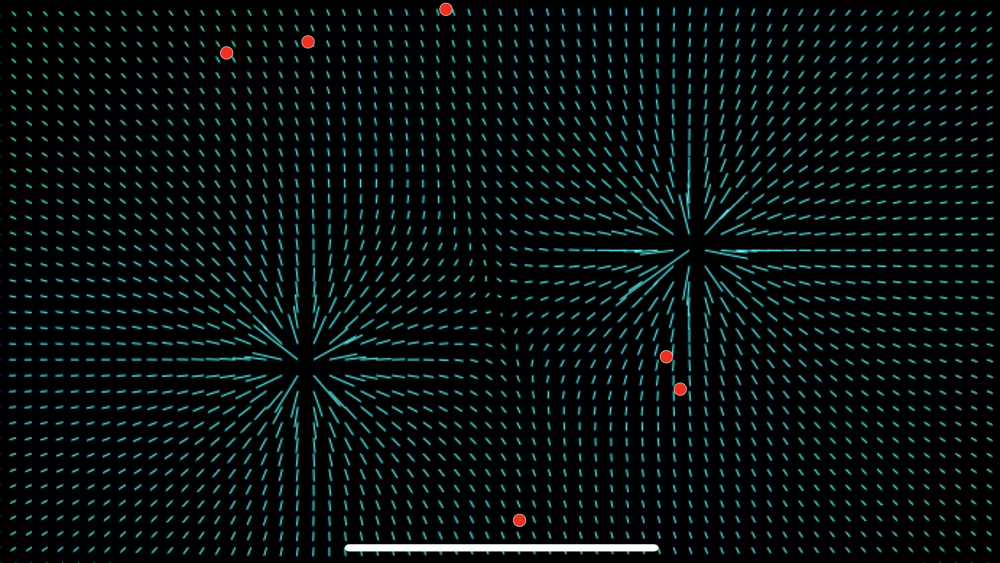

# ShowFields Swift Package

Apple's SpriteKit game framework allows the developer to use different kinds of physics fields through [`SKFieldNode`](https://developer.apple.com/documentation/spritekit/skfieldnode/). To visualize these fields, [`SKView`](https://developer.apple.com/documentation/spritekit/skview) has a [`showsFields`](https://developer.apple.com/documentation/spritekit/skview/1520443-showsfields) property, but unfortunately it is not customizable and doesn't always work properly.

This package was created to easily add field visualization to a Swift project, inspired by the code used in the [Field Control Game](https://youtu.be/TMrKkITYRYA?si=I6REWtvtmHS-DT17).

## Empty Scene Disclaimer

SpriteKit fields are not simulated/sampled correctly if the scene has no nodes to interact with them. This means that **the package will not work properly if there are only fields in the scene**. That's also why the example project spawns balls with charges in new touch and does not contain only fields that follow the player's touches.

## Usage

The `ShowFieldsExample` project provides an example on how to add the package components to your SpriteKit project.

1. Add a `DrawLinesView` to your view hierarchy behind your `SKView`, as seen in `ShowFieldsExample/GameView.swift`.

2. Add a `FieldSampler` to your `SKScene`. A reference to the `DrawLinesView` must be passed in the sampler initializer so that it can tell the view what to draw.

3. Call `updateLines()` in your update loop (typically in your scene's `update(_:)` method).

## Implementation Overview

To measure the scene's fields, the `FieldSampler` uses the [`sampleFields(at:)`](https://developer.apple.com/documentation/spritekit/skphysicsworld/1449627-samplefields) method of [SKPhysicsWorld](https://developer.apple.com/documentation/spritekit/skphysicsworld). The field is sampled in several points in the scene and then translated into lines to be drawn by `DrawLinesView` in UIKit in every cycle.

During the first implementation of this idea, attempts to draw the lines with SpriteKit were made, but the performance was a huge issue.
